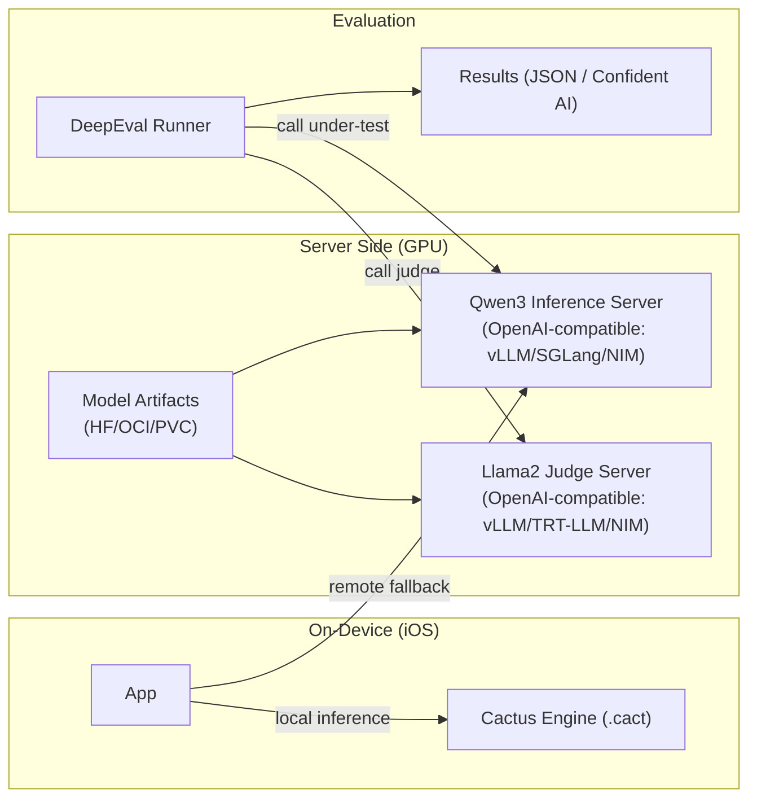
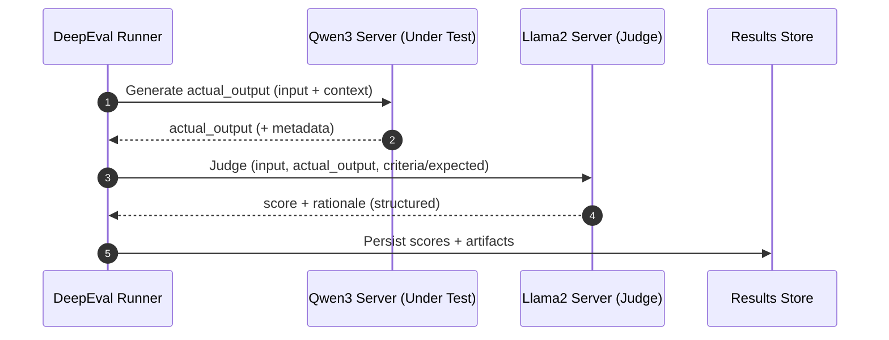

# Hybrid LLM Inference Architecture (On-Device + Server) — Addendum

## Purpose
Document a flexible architecture that supports **both on-device and server-side LLM inference**, and an MVP that uses **DeepEval** efficiently on the server to evaluate:
- **LLM under test**: Qwen3
- **LLM-as-a-judge**: Llama2

This addendum is intentionally technology-agnostic at the top level, but makes **explicit best-effort MVP decisions** at the bottom.

---

## Technology Inventory (Engines, Frameworks, Servers, Tooling)
This architecture intentionally keeps “model execution” behind standard interfaces so we can swap engines as constraints change.

### On-device inference runtimes / engines
- **Cactus**: on-device inference engine using proprietary `.cact` artifacts; supports hybrid routing concepts.
- **ExecuTorch**: edge/mobile runtime using `.pte` artifacts; iOS-friendly deployment path.
- **Apple MLX**: Apple/Metal-native tensor framework (Mac/iOS ecosystem), often used for local execution and experimentation.

### Server-side inference servers / runtimes
- **vLLM**: high-throughput GPU inference server with token-level scheduling (continuous batching).
- **SGLang**: serving runtime with strong batching/scheduling features (often OpenAI-compatible depending on deployment mode).
- **TensorRT-LLM**: NVIDIA GPU inference optimization runtime (custom kernels, inflight batching, paged KV caching, quantization, speculative decoding) with an online serving mode.
- **NVIDIA NIM**: packaged inference microservices that can use engines like TensorRT-LLM, vLLM, SGLang, etc., and exposes industry-standard APIs.
- **Lemonade Server**: OpenAI-compatible local/server API for LLM inference (useful for lightweight deployments).

### Model workflow / packaging
- **Unsloth**: workflow framework for training + running + exporting models; helps reduce effective VRAM needs by enabling smaller artifacts (e.g., GGUF exports) and adapter-based workflows.

### Evaluation / orchestration
- **DeepEval**: evaluation framework (pytest-like) that drives model calls to the **SUT** and to a **judge LLM**.

### Privacy & security patterns
- **PrivatemodeAI-style deployment pattern**: an **encryption / privacy proxy** in front of the inference server (commonly used with vLLM-style backends).
- **ALS (Apple / on-device learning concepts)**: relevant to future personalization / private adaptation; not an inference server.

### Common compatibility layers
- **OpenAI-compatible HTTP APIs**: de-facto interoperability layer (clients, eval harnesses, tools).
- **LiteLLM / adapter layers** (optional): unify disparate providers/servers behind one API surface.

---

## Key Design Concepts (with conceptual explanations)

### 1) Token-level scheduling vs session partitioning
These are two different ways to achieve concurrency.

**Token-level scheduling (e.g., vLLM)**
- The server maintains many active requests and interleaves *token generation work* across them.
- Goal: maximize GPU utilization and throughput under load.
- Tradeoff: needs careful KV-cache memory management and admission control.

**Session partitioning (common in simpler servers; conceptually closer to fixed slots)**
- The system allocates a bounded slice of compute/memory per session (or per “slot”).
- Goal: predictability and isolation.
- Tradeoff: can underutilize GPUs when sessions have uneven workloads.

**Hybrid in practice (what we mean in this architecture)**
- The same server can combine:
  - token-level scheduling inside the engine (interleaving tokens), and
  - session admission control at the request layer (caps like “max concurrent sequences”, queue depth, per-tenant limits).
- This is the most practical way to keep latency bounded while still benefiting from high throughput.

### 2) KV cache economics (why concurrency is usually memory-bound)
- During decoding, each active sequence maintains a KV cache that grows with:
  - context length,
  - number of layers,
  - hidden sizes,
  - number of concurrent sequences.
- In multi-user serving, **KV cache is often the true scaling limiter**, not raw FLOPs.

Implication: “efficient concurrency” requires explicit knobs for:
- max context (`max_model_len`),
- max active sequences,
- paging / eviction / prefix caching,
- batching policy.

### 3) VRAM reduction as a first-class lever (Unsloth’s contribution)
Unsloth’s “VRAM reduction” is best treated as a **capacity multiplier**:
- Smaller weight artifacts (via export/conversion workflows) reduce static VRAM.
- Adapter-based deployment (LoRA) reduces “VRAM per variant” vs duplicating full weights.

This does not replace server scheduling. Instead:
- **VRAM reduction increases how many concurrent sequences you can afford**, and/or
- enables larger models / longer contexts on the same GPU.

### 4) Standard API boundaries
To keep the architecture flexible:
- Evaluate, toolchains, and apps talk to “LLM endpoints” through **OpenAI-compatible APIs**.
- On-device inference is exposed via a **local client abstraction** that mirrors server requests (messages → text).

### 5) Privacy proxy pattern
For sensitive deployments:
- Put an encryption/proxy layer in front of inference servers.
- Keep the inference engine unchanged; treat privacy as an orthogonal concern.

---

## Architecture Overview

### High-level structure
- **On-device lane**: optimized for privacy, latency, offline capability.
- **Server lane**: optimized for throughput, concurrency, and centralized observability.
- **Evaluation lane**: DeepEval orchestrates calls to both the SUT and the judge.

### MVP deployment diagram (DeepEval + Qwen3 under test + Llama2 judge)

Text alternative (deployment):
- Mobile App runs on-device inference via Cactus.
- DeepEval Runner calls two server endpoints:
  - Qwen3 server (LLM under test)
  - Llama2 server (judge)
- Both servers load artifacts from a model store.
- DeepEval persists results to JSON (and optionally Confident AI).

---

## Process Flow (MVP evaluation loop)

Text alternative (process):
1. DeepEval loads a test case.
2. DeepEval calls the Qwen3 endpoint to obtain the system output.
3. DeepEval calls the Llama2 endpoint with a judge prompt (criteria + artifacts).
4. DeepEval computes metric scores and stores results.

---

## Explicit Design Decisions (Best-Effort MVP)
These are the recommended defaults for the MVP, chosen for interoperability and operational simplicity.

### Decision D-MVP-01: Use OpenAI-compatible server endpoints for both models
**Choice**: Serve Qwen3-under-test and Llama2-judge behind OpenAI-compatible endpoints.

**Rationale**:
- DeepEval integrates cleanly with providers and custom wrappers; OpenAI-compatible endpoints minimize glue code.
- Allows swapping vLLM ↔ SGLang ↔ NIM (and potentially TensorRT-LLM online serving) without rewriting evaluation logic.

### Decision D-MVP-02: Deploy judge and SUT as separate server instances
**Choice**: Run Qwen3 and Llama2 in separate server processes/deployments.

**Rationale**:
- Avoids resource contention and makes scheduling/quotas explicit.
- Judge traffic pattern (many short prompts) differs from SUT (can be long-context), so tuning knobs differ.

### Decision D-MVP-03: Prefer vLLM for the first server-side implementation
**Choice**: Start with vLLM for both endpoints (or vLLM for SUT, smaller/cheaper backend for judge).

**Rationale**:
- Strong concurrency defaults and token-level scheduling benefits for eval workloads.
- Existing evidence in this workspace shows successful vLLM deployment patterns.

### Decision D-MVP-04: Treat memory as the primary capacity constraint
**Choice**: size and tune using KV-cache and context limits first.

**Rationale**:
- Eval runs create bursty concurrency; KV cache is usually the first limiter.

---

## Decision Framework (How to Re-evaluate)
Re-evaluate engine/server choices whenever one of these constraints changes:

### Step 1 — Identify the bottleneck
- **OOM / low concurrency** → memory/KV cache constrained
- **Low throughput at high load** → scheduling/batching inefficiency
- **High TTFT** → prefill inefficiency, model warmup, IO, CPU affinity
- **Unstable outputs (judge flakiness)** → prompt confinement / JSON schema / retries

### Step 2 — Map bottleneck → lever
- Memory/KV constrained → quantization, smaller model, paged KV, shorter context, stricter admission control
- Scheduling constrained → token-level scheduling engines (vLLM/SGLang), inflight batching, better batching policy
- Latency constrained → TensorRT-LLM optimizations, CUDA graphs, kernel fusion, speculative decoding
- Operational constraints → NIM packaging, standard APIs, observability

### Step 3 — Choose the minimum change that fixes the bottleneck
- Change **knobs** before changing **engines**.
- Change **engine** before changing **API contract**.

---

## Notes on Security Extension
Security baseline extension is disabled in the current AI-DLC state for this project. If later enabled, this document should be extended with:
- TLS requirements between DeepEval and inference endpoints,
- access logging,
- secrets handling,
- dataset/result storage encryption.
