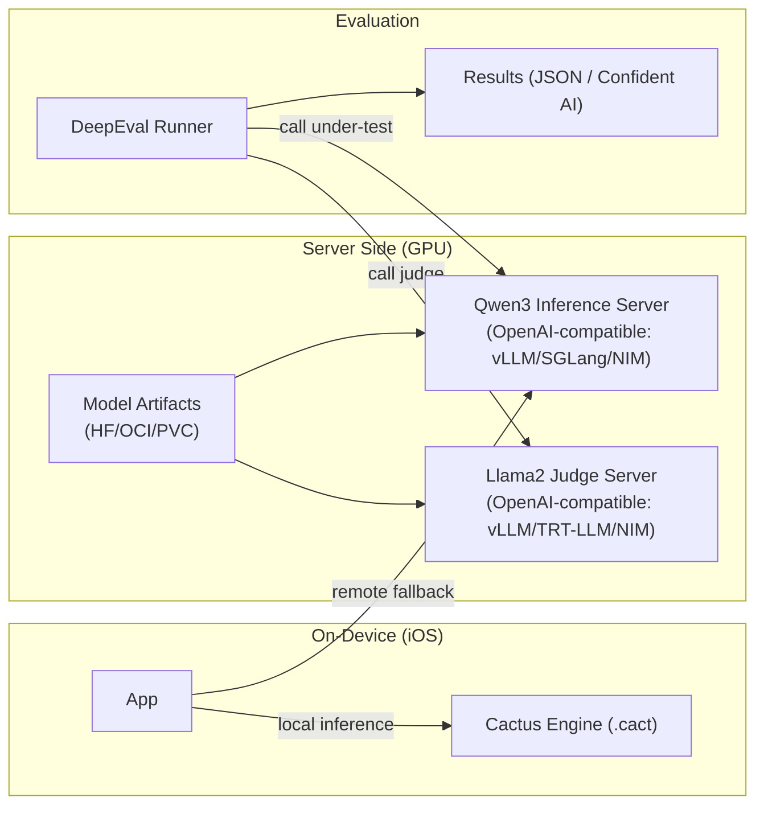
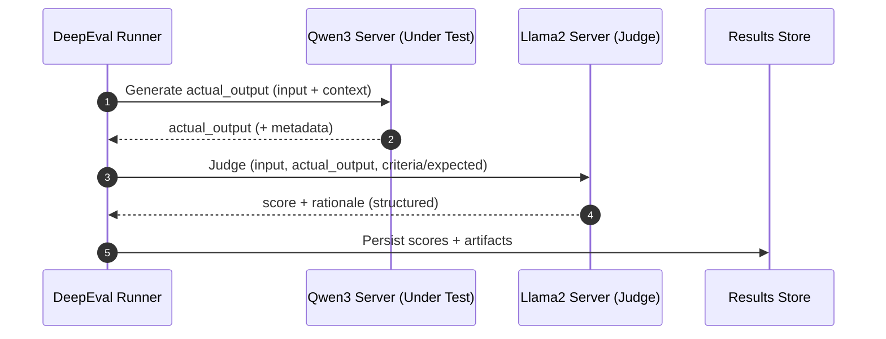
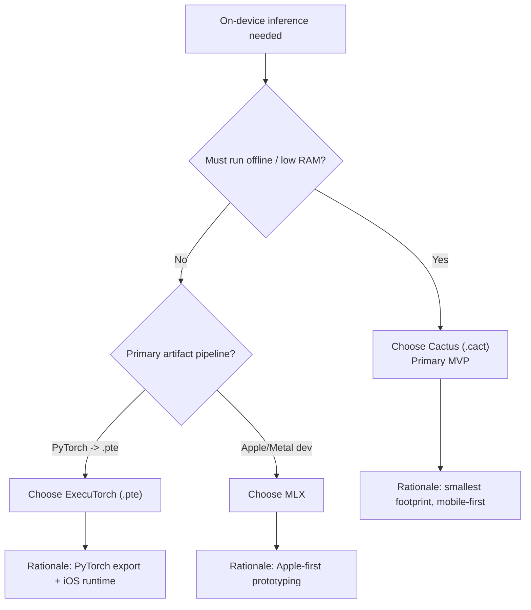

# Hybrid LLM Inference Architecture (On-Device + Server) — Addendum

## Purpose
Document a flexible architecture that supports **both on-device and server-side LLM inference**, and an MVP that uses **DeepEval** efficiently on the server to evaluate:
- **LLM under test**: Qwen3
- **LLM-as-a-judge**: Llama2

Ubiquitous language for this design domain is defined in [aidlc-docs/designdomain/README.md](../../designdomain/README.md).

This addendum is intentionally technology-agnostic at the top level, but makes **explicit best-effort MVP decisions** at the bottom.

---

## Technology Inventory (Engines, Frameworks, Servers, Tooling)
This architecture intentionally keeps “model execution” behind standard interfaces so we can swap engines as constraints change.

### On-device [[Model Inference Engine]]s
- **Cactus**: on-device [[Model Inference Engine]] using proprietary `.cact` artifacts; supports hybrid routing concepts.
- **ExecuTorch**: on-device [[Model Inference Engine]]/runtime using `.pte` artifacts; iOS-friendly deployment path.
- **Apple MLX**: Apple/Metal-native [[Model Inference Engine]]/runtime (Mac/iOS ecosystem), often used for local execution and experimentation.

### Server-side [[Model Inference Server]]s
- **vLLM**: [[Model Inference Server]] with token-level scheduling (continuous batching).
- **SGLang**: [[Model Inference Server]]/runtime with strong batching/scheduling features (often OpenAI-compatible depending on deployment mode).
- **TensorRT-LLM**: [[Model Inference Engine]]/runtime with an online serving mode (can be deployed as a [[Model Inference Server]]).
- **NVIDIA NIM**: packaged [[Model Inference Server]] microservices that can embed TensorRT-LLM, vLLM, SGLang, etc.
- **Lemonade Server**: OpenAI-compatible [[Model Inference Server]] (useful for lightweight deployments).

### Model workflow / packaging
- **Unsloth**: workflow framework for training + running + exporting models; helps reduce effective VRAM needs by enabling smaller artifacts (e.g., GGUF exports) and adapter-based workflows. In **MVP0 (D-EVAL-SUT-02)**, Unsloth also functions as the **in-process inference engine/runtime** that executes Qwen3 decoding inside the evaluation process.

### Evaluation / orchestration
- **DeepEval**: evaluation framework (pytest-like) that drives model calls to the **SUT** and to a **judge LLM**.

### Privacy & security patterns
- **PrivatemodeAI-style deployment pattern**: an **encryption / privacy proxy** in front of the [[Model Inference Server]] (commonly used with vLLM-style backends).
- **ALS (Apple / on-device learning concepts)**: relevant to future personalization / private adaptation; not an inference server.

### Common compatibility layers
- **OpenAI-compatible HTTP APIs**: de-facto interoperability layer (clients, eval harnesses, tools).
- **LiteLLM / adapter layers** (optional): unify disparate providers/servers behind one API surface.

---

## Key Design Concepts (with conceptual explanations)

### 1) Token-level scheduling vs session partitioning
These are two different ways to achieve concurrency.

**Token-level scheduling (e.g., vLLM)**
- The server maintains many active requests and interleaves *token generation work* across them.
- Goal: maximize GPU utilization and throughput under load.
- Tradeoff: needs careful KV-cache memory management and admission control.

**Session partitioning (common in simpler servers; conceptually closer to fixed slots)**
- The system allocates a bounded slice of compute/memory per session (or per “slot”).
- Goal: predictability and isolation.
- Tradeoff: can underutilize GPUs when sessions have uneven workloads.

**Hybrid in practice (what we mean in this architecture)**
- The same server can combine:
  - token-level scheduling inside the engine (interleaving tokens), and
  - session admission control at the request layer (caps like “max concurrent sequences”, queue depth, per-tenant limits).
- This is the most practical way to keep latency bounded while still benefiting from high throughput.

### 2) KV cache economics (why concurrency is usually memory-bound)
- During decoding, each active sequence maintains a KV cache that grows with:
  - context length,
  - number of layers,
  - hidden sizes,
  - number of concurrent sequences.
- In multi-user serving, **KV cache is often the true scaling limiter**, not raw FLOPs.

Implication: “efficient concurrency” requires explicit knobs for:
- max context (`max_model_len`),
- max active sequences,
- paging / eviction / prefix caching,
- batching policy.

### 3) VRAM reduction as a first-class lever (Unsloth’s contribution)
Unsloth’s “VRAM reduction” is best treated as a **capacity multiplier**:
- Smaller weight artifacts (via export/conversion workflows) reduce static VRAM.
- Adapter-based deployment (LoRA) reduces “VRAM per variant” vs duplicating full weights.

This does not replace server scheduling. Instead:
- **VRAM reduction increases how many concurrent sequences you can afford**, and/or
- enables larger models / longer contexts on the same GPU.

### 4) Standard API boundaries
To keep the architecture flexible:
- Evaluate, toolchains, and apps talk to “LLM endpoints” through **OpenAI-compatible APIs**.
- On-device inference is exposed via a **local client abstraction** that mirrors server requests (messages → text).

### 5) Privacy proxy pattern
For sensitive deployments:
- Put an encryption/proxy layer in front of [[Model Inference Server]]s.
- Keep the [[Model Inference Engine]] unchanged; treat privacy as an orthogonal concern.

---

## Architecture Overview

### High-level structure
- **On-device lane**: optimized for privacy, latency, offline capability.
- **Server lane**: optimized for throughput, concurrency, and centralized observability.
- **Evaluation lane**: DeepEval orchestrates calls to both the SUT and the judge.

### MVP deployment diagram (DeepEval + Qwen3 under test + Llama2 judge)

Text alternative (deployment):
- Mobile App runs on-device inference via Cactus.
- DeepEval Runner calls two server endpoints:
  - Qwen3 server (LLM under test)
  - Llama2 server (judge)
- Both servers load artifacts from a model store.
- DeepEval persists results to JSON (and optionally Confident AI).

---

## Process Flow (MVP evaluation loop)

Text alternative (process):
1. DeepEval loads a test case.
2. DeepEval calls the Qwen3 endpoint to obtain the system output.
3. DeepEval calls the Llama2 endpoint with a judge prompt (criteria + artifacts).
4. DeepEval computes metric scores and stores results.

---

## Explicit Design Decisions (Best-Effort MVP)
These are the recommended defaults for the MVP, chosen for interoperability and operational simplicity.

### Decision D-DEVICE-01: Default on-device [[Model Inference Engine]] is Cactus
**Choice**: Use **Cactus** as the default on-device [[Model Inference Engine]] for the MVP.

**Rationale**:
- The mobile lane’s primary requirements are offline capability, low latency, and tight memory budgets; Cactus is purpose-built for this form factor.
- Cactus uses a purpose-built artifact format (`.cact`) and runtime, which is aligned with “ship a model into an app” workflows.

**Implication**:
- On-device model packaging is a first-class pipeline concern (export/build `.cact` artifacts), separate from server packaging.

### Decision D-DEVICE-02: ExecuTorch and MLX are supported as secondary on-device paths
**Choice**:
- Use **ExecuTorch** when the primary artifact pipeline is **PyTorch → `.pte`** and the team wants a PyTorch-native edge runtime.
- Use **MLX** primarily for Apple/Metal-centric prototyping and experimentation (and optionally for Mac-first local execution).

**Rationale**:
- ExecuTorch offers a well-defined “export then run” runtime model on mobile.
- MLX reduces friction for Apple-hardware experimentation, but it is not a drop-in substitute for a production iOS inference engine in all scenarios.

### On-device runtime selection (decision diagram)

Text alternative (on-device selection):
- If strict offline + low memory constraints dominate → choose Cactus.
- If the artifact pipeline is PyTorch export to `.pte` and you want a PyTorch-native mobile runtime → choose ExecuTorch.
- If you are doing Apple/Metal-first prototyping (often Mac-first) → choose MLX.

### Decision D-MVP-01: Use OpenAI-compatible server endpoints for both models
**Choice**: Serve Qwen3-under-test and Llama2-judge behind OpenAI-compatible endpoints.

**Rationale**:
- DeepEval integrates cleanly with providers and custom wrappers; OpenAI-compatible endpoints minimize glue code.
- Allows swapping vLLM ↔ SGLang ↔ NIM (and potentially TensorRT-LLM online serving) without rewriting evaluation logic.

### Decision D-MVP-02: Deploy judge and SUT as separate server instances
**Choice**: Run Qwen3 and Llama2 in separate server processes/deployments.

**Rationale**:
- Avoids resource contention and makes scheduling/quotas explicit.
- Judge traffic pattern (many short prompts) differs from SUT (can be long-context), so tuning knobs differ.

### Decision D-MVP-03: Prefer vLLM for the first server-side implementation
**Choice**: Start with vLLM for both endpoints (or vLLM for SUT, smaller/cheaper backend for judge).

**Rationale**:
- Strong concurrency defaults and token-level scheduling benefits for eval workloads.
- Existing evidence in this workspace shows successful vLLM deployment patterns.

### Decision D-MVP-04: Treat memory as the primary capacity constraint
**Choice**: size and tune using KV-cache and context limits first.

**Rationale**:
- Eval runs create bursty concurrency; KV cache is usually the first limiter.

### Decision D-EVAL-01: DeepEval treats the SUT and judge as separate, versioned services
**Choice**: DeepEval evaluation runs target:
- one endpoint for the **LLM under test** (Qwen3)
- a separate endpoint for the **judge** (Llama2)

**Rationale**:
- DeepEval’s workload shape is typically “many relatively small judge calls” plus “SUT calls that may be longer-context”; separating them allows independent tuning and capacity planning.
- Versioning and reproducibility: pin the SUT model artifact + judge model artifact + prompts/criteria so evaluation deltas are attributable.

**Operational guidance** (MVP defaults):
- Use bounded parallelism on the DeepEval side to avoid overwhelming the server (match concurrency to server admission controls).
- Prefer structured judge outputs (JSON-like) and add retries/robust parsing where needed to reduce eval flakiness.

### Decision D-SERVER-01: For DeepEval, prefer vLLM over Lemonade when concurrency matters
**Choice**:
- Use **vLLM** as the default server for the MVP DeepEval runs.
- Use **Lemonade** for lightweight/simpler deployments (developer machines, low concurrency, quick experiments).

**Rationale**:
- vLLM’s token-level scheduling is well-suited to evaluation workloads that generate concurrent requests.
- Lemonade’s value is operational simplicity and OpenAI-compatible integration when you do not need high concurrency.

**Selection guide (vLLM vs Lemonade)**:
- Pick **vLLM** when you need: high throughput, many concurrent eval workers, large models, or long contexts.
- Pick **Lemonade** when you need: simplest local serving, low parallelism, or a quick OpenAI-compatible endpoint for development.

### Decision D-EVAL-SUT-02: MVP0 runs Qwen3-under-test inference in-process via Unsloth
**Choice**: For the current MVP implementation (`code/unsloth_example_1/`), run the **LLM under test (Qwen3)** *in-process* in Python via Unsloth (`FastLanguageModel.from_pretrained(...)`) instead of calling a server endpoint.

**Interpretation (terminology)**: In this MVP0 topology, Unsloth is acting as the [[Model Inference Engine]] (weights + tokenization + forward pass + decoding loop) embedded in-process. This is distinct from a [[Model Inference Server]] (e.g., vLLM) which externalizes that engine behind an HTTP API and adds scheduling/admission control.

**Rationale**:
- **Fast iteration**: removes a full operational surface (server lifecycle, networking, endpoint auth) while we stabilize datasets, prompts, metrics, and thresholds.
- **Ground-truthing**: evaluation failures are easier to attribute to model behavior rather than serving configuration, batching policy, or HTTP/client issues.
- **Cost control**: avoids optimizing a serving layer before we know which suites/metrics will remain in the MVP.

**Tradeoffs / limitations**:
- Does **not** exercise the server-side concerns that D-MVP-03 / D-SERVER-01 target (token-level scheduling, admission control, KV-cache pressure under concurrent sessions).
- Makes it harder to compare server engines (vLLM vs SGLang vs TensorRT-LLM) because the engine is not in the loop.

**Exit criteria (when we must move SUT behind a server endpoint)**:
- We need to measure **concurrency**, **throughput**, **TTFT**, or stability under parallel DeepEval runs.
- We need the evaluation topology to match the production serving architecture.

**Next step (MVP1 alignment)**: Serve Qwen3-under-test behind an OpenAI-compatible server (default: **vLLM**) so the evaluation harness exercises token-level scheduling + admission control in practice.

---

## Decision Criteria: D-EVAL-SUT-02 vs D-SERVER-01 (MVP Qwen3 DeepEval in `code/unsloth_example_1/`)
This section explains **when to keep Qwen3 inference in-process** (D-EVAL-SUT-02) vs **when to move Qwen3 behind vLLM** (D-SERVER-01) for the specific DeepEval tests already implemented in this repo.

### What these two decisions actually control
- **D-EVAL-SUT-02** controls *how the SUT output is produced*: local GPU inference inside the pytest process.
- **D-SERVER-01** controls *how the SUT would be produced once served*: an OpenAI-compatible [[Model Inference Server]] (default vLLM) whose scheduling, KV cache, and admission control behavior are now part of the evaluation.

### MVP0 (in-process) is the best fit when the goal is “model quality correctness”
Use D-EVAL-SUT-02 when the evaluation objective is primarily:
- validating QAT vs base model deltas on *content quality* (math correctness, reasoning quality, chat relevancy),
- debugging prompt templates and datasets,
- ensuring regressions are attributable to the model (not to serving config).

In the current implementation, most suites are exactly of this type:
- **LLM-judge suites** (GEval-based): correctness, reasoning quality, COT format compliance, final answer extraction, instruction following, response completeness, multi-turn coherence.
- **Programmatic suites**: think-token balance/usage, expected-answer exact match, regex extractability checks.

All of those suites only need one thing from the SUT: **a stable `actual_output` string**. They do not inherently require a server.

### MVP1 (served via vLLM) is required when the goal includes “serving realism + concurrency”
Move to D-SERVER-01 (serve Qwen3 behind vLLM) when the evaluation objective includes any of:
- **Concurrency/throughput testing**: e.g., running DeepEval/pytest with parallelism (`-n`) and measuring tail latency.
- **TTFT / streaming behavior**: validating time-to-first-token and/or token streaming semantics used by clients.
- **Production fidelity**: ensuring the model-under-test behaves the same when invoked through the same API path as production.

The important point: once Qwen3 is behind vLLM, the evaluation starts measuring a *system* (model + runtime + scheduler + context limits), not just a checkpoint.

### Criteria checklist (practical for this repo)
Prefer **D-EVAL-SUT-02 (in-process)** when you want:
- Lowest integration complexity (no model server to run/manage)
- Maximum determinism in debugging (one process, one tokenizer/template)
- Fast iteration on metrics/thresholds/testcase generation

Prefer **D-SERVER-01 (vLLM)** when you need:
- Evidence about token-level scheduling vs admission control under load
- Confidence that evaluation matches deployed inference topology
- Server-level observability and capacity tuning (KV cache sizing, max active seqs)

### Mapping to the existing DeepEval tests (what changes if you move to vLLM)
For the current `tests/test_model_quality.py` suites:
- **Most tests remain conceptually valid** after migration, because they still judge the `actual_output`.
- **However, expect score drift** if any of these change between in-process vs server:
  - chat template / system prompt framing
  - tokenizer version or special token handling
  - default sampling settings (temperature/top-p/max tokens)
  - context truncation (`max_model_len`) and stop conditions

So the migration rule is:
1) Keep the *evaluation prompts and generation settings* constant.
2) Only then compare metric outcomes between in-process and vLLM.

### Recommended MVP sequencing for this implementation
1) **MVP0 (now)**: Keep D-EVAL-SUT-02 for Qwen3 SUT, and treat the current tests as “checkpoint quality gates”.
2) **MVP0.5 (optional)**: Move only the **judge** to a self-hosted endpoint (e.g., Llama2 behind vLLM) to reduce OpenAI cost while leaving SUT in-process.
3) **MVP1**: Move the SUT behind vLLM (D-SERVER-01) once you need concurrency/TTFT/system realism; re-baseline thresholds if needed.

---

## Compatibility Check: Existing Unsloth Example Implementation vs vLLM Decisions
This repo contains a concrete evaluation implementation under `code/unsloth_example_1/`.

### What the current Unsloth example does
- **SUT (Qwen3)**: runs inference **in-process** in Python via Unsloth (`FastLanguageModel.from_pretrained(...)`) rather than via a server endpoint (**per Decision D-EVAL-SUT-02**).
- **Judge**: uses DeepEval’s default LLM-as-judge configuration and documents **OpenAI GPT-4 by default**, requiring `OPENAI_API_KEY`.

### Compatibility with D-MVP-03 and D-SERVER-01
- **MVP0 intentionally deviates** from the “vLLM-first server-side implementation” intent because the SUT is local/in-process (**per Decision D-EVAL-SUT-02**).
- **MVP1 compliance path**: to satisfy D-MVP-03 and D-SERVER-01 in practice, move the SUT behind an OpenAI-compatible endpoint (default: vLLM).
- **Partially compatible at the infrastructure level**: the RunPod GPU devcontainer is a suitable environment to *run* a vLLM OpenAI-compatible server, but it is not wired into the evaluation code today.

### Minimal paths to align the implementation with the vLLM decisions
1) **Judge-first alignment (low code churn)**
  - Keep Qwen3 SUT inference in-process (**per Decision D-EVAL-SUT-02**).
  - Replace the OpenAI judge with a **self-hosted Llama2 judge served behind vLLM** (OpenAI-compatible), and configure DeepEval to use that judge.

2) **Full alignment (matches the MVP diagrams)**
  - Serve **Qwen3-under-test** behind vLLM (OpenAI-compatible).
  - Serve **Llama2 judge** behind vLLM (or TensorRT-LLM/NIM if desired).
  - Update the evaluation runner so DeepEval calls both endpoints instead of calling Qwen3 locally.

---

## Decision Framework (How to Re-evaluate)
Re-evaluate engine/server choices whenever one of these constraints changes:

### Step 1 — Identify the bottleneck
- **OOM / low concurrency** → memory/KV cache constrained
- **Low throughput at high load** → scheduling/batching inefficiency
- **High TTFT** → prefill inefficiency, model warmup, IO, CPU affinity
- **Unstable outputs (judge flakiness)** → prompt confinement / JSON schema / retries

### Step 2 — Map bottleneck → lever
- Memory/KV constrained → quantization, smaller model, paged KV, shorter context, stricter admission control
- Scheduling constrained → token-level scheduling engines (vLLM/SGLang), inflight batching, better batching policy
- Latency constrained → TensorRT-LLM optimizations, CUDA graphs, kernel fusion, speculative decoding
- Operational constraints → NIM packaging, standard APIs, observability

### Step 3 — Choose the minimum change that fixes the bottleneck
- Change **knobs** before changing **engines**.
- Change **engine** before changing **API contract**.

---

## Notes on Security Extension
Security baseline extension is disabled in the current AI-DLC state for this project. If later enabled, this document should be extended with:
- TLS requirements between DeepEval and inference endpoints,
- access logging,
- secrets handling,
- dataset/result storage encryption.
