# Execution Plan

## Detailed Analysis Summary

### Transformation Scope (Greenfield)
- **Transformation Type**: New greenfield system implementation
- **Primary Changes**: Build hybrid mobile+server inference application and architecture from scratch
- **Related Components**: Mobile client app, on-device inference adapter, server inference API, routing and memory modules, evaluation/telemetry pipeline

### Change Impact Assessment
- **User-facing changes**: Yes — new shopping planning assistant UX and multi-turn behaviors
- **Structural changes**: Yes — hybrid runtime with routing, memory, and context integrity subsystems
- **Data model changes**: Yes — user profile, preference memory, context checkpoints, readiness/fine-tuning signals
- **API changes**: Yes — new server inference and policy-evaluation interfaces
- **NFR impact**: Yes — latency, reliability, observability, privacy and routing transparency

### Risk Assessment
- **Risk Level**: High
- **Rollback Complexity**: Moderate (greenfield feature toggles can reduce deployment risk)
- **Testing Complexity**: Complex (hybrid paths, multi-turn memory, context-rot and readiness policies)

## Workflow Visualization

### Mermaid Diagram

```mermaid
flowchart TD
    Start(["User Request"])

    subgraph INCEPTION["INCEPTION PHASE"]
        WD["Workspace Detection<br/><b>COMPLETED</b>"]
        RE["Reverse Engineering<br/><b>SKIP</b>"]
        RA["Requirements Analysis<br/><b>COMPLETED</b>"]
        US["User Stories<br/><b>COMPLETED</b>"]
        WP["Workflow Planning<br/><b>COMPLETED</b>"]
        AD["Application Design<br/><b>EXECUTE</b>"]
        UG["Units Generation<br/><b>EXECUTE</b>"]
    end

    subgraph CONSTRUCTION["CONSTRUCTION PHASE"]
        FD["Functional Design<br/><b>EXECUTE</b>"]
        NFRA["NFR Requirements<br/><b>EXECUTE</b>"]
        NFRD["NFR Design<br/><b>EXECUTE</b>"]
        ID["Infrastructure Design<br/><b>EXECUTE</b>"]
        CG["Code Generation<br/><b>EXECUTE</b>"]
        BT["Build and Test<br/><b>EXECUTE</b>"]
    end

    subgraph OPERATIONS["OPERATIONS PHASE"]
        OPS["Operations<br/><b>PLACEHOLDER</b>"]
    end

    Start --> WD
    WD -.-> RE
    WD --> RA
    RE --> RA
    RA --> US
    US --> WP
    WP --> AD
    AD --> UG
    UG --> FD
    FD --> NFRA
    NFRA --> NFRD
    NFRD --> ID
    ID --> CG
    CG --> BT
    BT -.-> OPS
    BT --> End(["Complete"])

    style WD fill:#4CAF50,stroke:#1B5E20,stroke-width:3px,color:#fff
    style RA fill:#4CAF50,stroke:#1B5E20,stroke-width:3px,color:#fff
    style US fill:#4CAF50,stroke:#1B5E20,stroke-width:3px,color:#fff
    style WP fill:#4CAF50,stroke:#1B5E20,stroke-width:3px,color:#fff
    style RE fill:#BDBDBD,stroke:#424242,stroke-width:2px,stroke-dasharray: 5 5,color:#000

    style AD fill:#FFA726,stroke:#E65100,stroke-width:3px,stroke-dasharray: 5 5,color:#000
    style UG fill:#FFA726,stroke:#E65100,stroke-width:3px,stroke-dasharray: 5 5,color:#000
    style FD fill:#FFA726,stroke:#E65100,stroke-width:3px,stroke-dasharray: 5 5,color:#000
    style NFRA fill:#FFA726,stroke:#E65100,stroke-width:3px,stroke-dasharray: 5 5,color:#000
    style NFRD fill:#FFA726,stroke:#E65100,stroke-width:3px,stroke-dasharray: 5 5,color:#000
    style ID fill:#FFA726,stroke:#E65100,stroke-width:3px,stroke-dasharray: 5 5,color:#000
    style CG fill:#4CAF50,stroke:#1B5E20,stroke-width:3px,color:#fff
    style BT fill:#4CAF50,stroke:#1B5E20,stroke-width:3px,color:#fff

    style OPS fill:#BDBDBD,stroke:#424242,stroke-width:2px,stroke-dasharray: 5 5,color:#000
    style INCEPTION fill:#BBDEFB,stroke:#1565C0,stroke-width:3px,color:#000
    style CONSTRUCTION fill:#C8E6C9,stroke:#2E7D32,stroke-width:3px,color:#000
    style OPERATIONS fill:#FFF59D,stroke:#F57F17,stroke-width:3px,color:#000
    style Start fill:#CE93D8,stroke:#6A1B9A,stroke-width:3px,color:#000
    style End fill:#CE93D8,stroke:#6A1B9A,stroke-width:3px,color:#000

    linkStyle default stroke:#333,stroke-width:2px
```

### Text Alternative
- INCEPTION completed: Workspace Detection, Requirements Analysis, User Stories, Workflow Planning
- INCEPTION next: Application Design, Units Generation
- CONSTRUCTION planned: Functional Design, NFR Requirements, NFR Design, Infrastructure Design, Code Generation, Build and Test
- OPERATIONS: Placeholder only

## Phases to Execute

### 🔵 INCEPTION PHASE
- [x] Workspace Detection (COMPLETED)
- [x] Reverse Engineering (SKIPPED)
  - **Rationale**: Greenfield workspace with no existing codebase artifacts
- [x] Requirements Analysis (COMPLETED)
- [x] User Stories (COMPLETED)
- [x] Workflow Planning (COMPLETED)
- [ ] Application Design — EXECUTE
  - **Rationale**: New components/services and method boundaries must be explicitly designed
- [ ] Units Generation — EXECUTE
  - **Rationale**: Work must be decomposed into implementable units across mobile, server, and shared policy/evaluation capabilities

### 🟢 CONSTRUCTION PHASE
- [ ] Functional Design — EXECUTE
  - **Rationale**: Complex memory/context and routing logic require detailed behavior design
- [ ] NFR Requirements — EXECUTE
  - **Rationale**: Latency, reliability, observability, and privacy constraints need concrete acceptance targets
- [ ] NFR Design — EXECUTE
  - **Rationale**: NFR patterns must be embedded into architecture (telemetry, safeguards, policy enforcement)
- [ ] Infrastructure Design — EXECUTE
  - **Rationale**: Hybrid topology requires service/deployment mapping for server inference and support components
- [ ] Code Generation — EXECUTE
  - **Rationale**: Core implementation output of workflow
- [ ] Build and Test — EXECUTE
  - **Rationale**: Validation of hybrid behavior and acceptance criteria contracts

### 🟡 OPERATIONS PHASE
- [ ] Operations — PLACEHOLDER
  - **Rationale**: Not in active scope of current AI-DLC workflow implementation

## Module Update Strategy
- **Update Approach**: Hybrid (parallel development across mobile/server modules after shared contracts are defined)
- **Critical Path**: Routing policy contracts and memory/context policy schemas
- **Coordination Points**: API contracts, policy DSL schema, evaluation metrics schema
- **Testing Checkpoints**: Contract tests after each unit, integration tests after core routing+memory implementation

## Execution Plan Summary
- **Total Stages Remaining Before Code**: 2 INCEPTION stages (Application Design, Units Generation)
- **Construction Stages Planned**: 6
- **Stages to Execute**: Application Design, Units Generation, Functional Design, NFR Requirements, NFR Design, Infrastructure Design, Code Generation, Build and Test
- **Stages to Skip**: Reverse Engineering (already skipped), Operations (placeholder)

## Estimated Timeline
- **Inception Remaining**: 1–2 working sessions
- **Construction Design + Code + Validation**: 4–7 working sessions (MVP scope)

## Success Criteria
- **Primary Goal**: Deliver hybrid iOS+server shopping planning assistant architecture and implementation aligned with approved requirements and user stories
- **Key Deliverables**: Architecture/design artifacts, code units, acceptance test assets, build-and-test instructions
- **Quality Gates**: Route correctness, memory continuity, context-rot handling, sufficiency signaling, fine-tuning trigger correctness

## Extension Compliance Summary
- **Security Baseline Extension**: Disabled by project decision in Requirements Analysis; marked N/A for enforcement at this stage
- **Applicability Rationale**: Project explicitly selected MVP posture with deferred mandatory security rule enforcement
