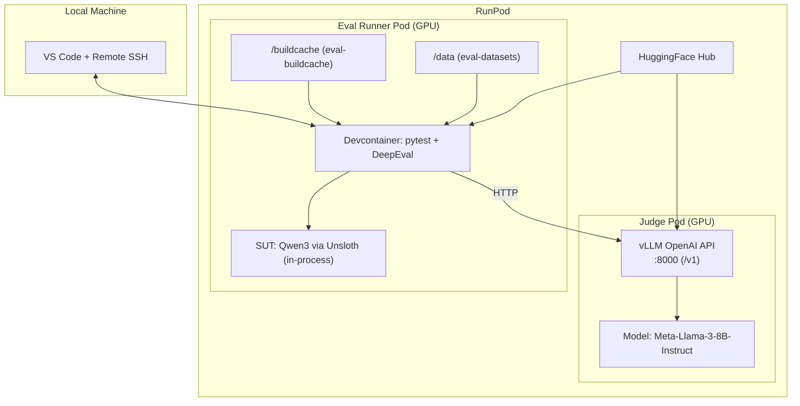
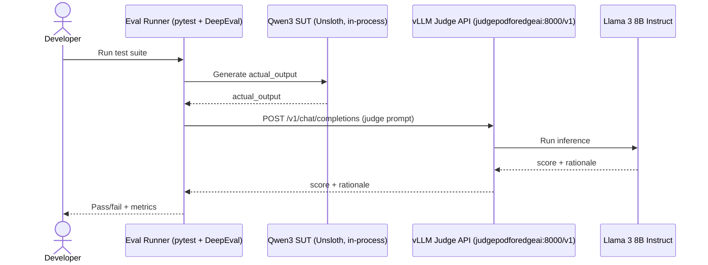

# Running Evaluations on RunPod — Dev Container Workflow

End-to-end guide for running the Qwen3-0.6B QAT evaluation pipeline on
RunPod using a VS Code dev container with persistent network volumes.

---

## Architecture Overview

```
Local Machine                          RunPod Pod (GPU)
┌─────────────┐    SSH tunnel    ┌─────────────────────────────────────┐
│  VS Code    │◄────────────────►│  Dev Container                      │
│  + Remote   │                  │  ┌───────────────────────────────┐  │
│    SSH ext  │                  │  │ /workspace   ← git clone      │  │
│             │                  │  │ /buildcache  ← Named Volume 1  │  │
│             │                  │  │   venv/          (uv venv)    │  │
│             │                  │  │   pkg-cache/                   │  │
│             │                  │  │   pycache/ pytest/ ruff/ mypy/│  │
│             │                  │  │ /data        ← Named Volume 2  │  │
│             │                  │  │   huggingface/  (datasets)    │  │
│             │                  │  │   eval_results/ (output JSON) │  │
│             │                  │  │   phone_model/  (trained QAT) │  │
│             │                  │  └───────────────────────────────┘  │
│             │                  │  GPU: T4 / A10G (CUDA passthrough)  │
└─────────────┘                  └─────────────────────────────────────┘
```

**Key principle**: The pod is disposable. Build byproducts (virtualenvs,
caches) live in `/buildcache` — a named Docker volume (`eval-buildcache`).
They never pollute the project workspace. Datasets and results persist on
the `/data` network volume (`eval-datasets`). Both volumes can be synced to
RunPod as network volumes.

---

## Runtime Environment Diagrams

### Deployment Diagram (Mermaid)



Text alternative (deployment):
- Local machine runs VS Code and connects to RunPod via Remote SSH.
- **Eval Runner Pod (GPU)** runs the devcontainer that executes pytest/DeepEval; it runs **Qwen3 SUT inference in-process** via Unsloth.
- **Judge Pod (GPU)** runs a **vLLM OpenAI-compatible server** on port `8000` serving **Meta-Llama-3-8B-Instruct**.
- Eval runner calls the judge over HTTP at `DEEPEVAL_JUDGE_BASE_URL` (MVP default: `http://judgepodforedgeai:8000/v1`).
- Both pods may pull models/datasets from HuggingFace Hub; eval runner persists build artifacts in `/buildcache` and datasets/results/models in `/data`.

### Evaluation Flow (Mermaid Sequence)



Text alternative (flow):
1. Developer runs the eval suite in the eval runner devcontainer.
2. DeepEval generates model outputs by running Qwen3 in-process (Unsloth).
3. For LLM-as-judge metrics, DeepEval sends a judge prompt to vLLM (`/v1/chat/completions`).
4. vLLM runs the judge model (Llama 3 8B Instruct) and returns score/rationale.
5. DeepEval reports pass/fail and aggregates metrics.

## File Reference

| File | Purpose |
|------|---------|
| [`.devcontainer/Dockerfile`](../.devcontainer/Dockerfile) | Container image: PyTorch + CUDA + uv + SSH |
| [`.devcontainer/devcontainer.json`](../.devcontainer/devcontainer.json) | VS Code dev container config: volumes, env vars, extensions |
| [`.devcontainer/setup.sh`](../.devcontainer/setup.sh) | Post-create script: installs deps, caches datasets, checks GPU |
| [`training/evaluate_model.py`](evaluate_model.py) | Standalone evaluation orchestrator (10 metrics, 5 suites) |
| [`tests/conftest.py`](../tests/conftest.py) | Session-scoped pytest fixtures for model/data/test-cases |
| [`tests/test_model_quality.py`](../tests/test_model_quality.py) | 13 parametrized test classes (~210 tests) |
| [`training/EVALUATIONS.md`](EVALUATIONS.md) | Detailed evaluation guide (metrics, thresholds, interpretation) |
| [`pyproject.toml`](../pyproject.toml) | uv dependencies (deepeval, pytest, unsloth, etc.) |

---

## Prerequisites

1. **RunPod account** with billing configured
2. **SSH key** uploaded to RunPod (Dashboard → Settings → SSH Keys)
3. **VS Code** with these extensions installed locally:
   - [Remote - SSH](https://marketplace.visualstudio.com/items?itemName=ms-vscode-remote.remote-ssh)
   - [Dev Containers](https://marketplace.visualstudio.com/items?itemName=ms-vscode-remote.remote-containers)
4. **vLLM judge endpoint** (Llama 3) for LLM-as-judge metrics
5. (Optional) **Confident AI login** for dashboard tracking: `deepeval login`

---

## Step 1: Create Network Volumes (one-time)

In RunPod Dashboard → **Storage** → **Network Volumes**, create two volumes
in the **same data center region** you'll launch pods in:

| Volume Name | Size | Purpose |
|-------------|------|---------|
| `eval-buildcache` | 20 GB | uv venv, download cache, `__pycache__`, tool caches |
| `eval-datasets` | 50 GB | HuggingFace datasets, trained models, eval results |

> **Cost**: Network volumes cost ~$0.07/GB/month when idle.
> 70 GB total = ~$4.90/month if kept attached.

---

## Step 1b: Sync Build Cache to RunPod (after local build)

After opening the dev container locally (which runs `setup.sh` and
populates the `eval-buildcache` Docker volume), export and upload it to
the RunPod network volume. This avoids rebuilding on the GPU pod.

### Export the local volume

```bash
# From your local machine (outside the container)
docker run --rm \
  -v eval-buildcache:/src:ro \
  -v $(pwd):/out \
  alpine tar czf /out/buildcache.tar.gz -C /src .
```

### Upload to RunPod

Launch a minimal pod with the `eval-buildcache` network volume attached
(or use an existing pod), then:

```bash
# Upload to the pod
scp buildcache.tar.gz runpod-eval:/buildcache/

# Extract on RunPod (SSH into the pod)
ssh runpod-eval "cd /buildcache && tar xzf buildcache.tar.gz && rm buildcache.tar.gz"
```

After this, the RunPod network volume contains the fully built venv,
package cache, and marker file. Subsequent pod launches skip the
dependency install step entirely.

> **When to re-sync**: After adding/removing dependencies locally. For
> small deltas, you can skip re-syncing — `uv sync --locked` on the pod
> will install only the missing packages from PyPI.

---

## Step 2: Launch Pod

### Option A: RunPod Dashboard (UI)

1. **GPU**: Select **NVIDIA T4** (16 GB, cheapest — sufficient for 0.6B model)
   - Or **A10G** (24 GB) if running QAT regression tests (two models loaded)
2. **Template**: Select **RunPod PyTorch 2.4.0**
3. **Network Volumes**: Attach:
   - `eval-buildcache` → mount at `/buildcache`
   - `eval-datasets` → mount at `/data`
4. **Expose ports**: `22` (SSH)
5. **Environment Variables**:
  - `DEEPEVAL_JUDGE_BASE_URL` = `http://<judge-host>:8000/v1`
  - `DEEPEVAL_JUDGE_MODEL` = `meta-llama/Meta-Llama-3-8B-Instruct`
  - `DEEPEVAL_JUDGE_API_KEY` = `local-vllm`
6. Launch the pod

### Step 2b (MVP): Launch the Judge Server (vLLM + Llama 3)

For this MVP topology, run the judge as a separate OpenAI-compatible server.

Recommended approach on RunPod: create a second pod dedicated to the judge and run vLLM there.

Minimum configuration:
- Expose port `8000` on the judge pod
- Start vLLM with a Llama 3 instruct model

Example vLLM command (judge pod):

```bash
# On the judge pod
docker run --rm --gpus all --shm-size=8g -p 8000:8000 \
  vllm/vllm-openai:latest \
  --model meta-llama/Meta-Llama-3-8B-Instruct \
  --host 0.0.0.0 --port 8000
```

Then, in the eval runner devcontainer, point DeepEval to the judge:

```bash
export DEEPEVAL_JUDGE_BASE_URL="http://judgepodforedgeai:8000/v1"
export DEEPEVAL_JUDGE_MODEL="meta-llama/Meta-Llama-3-8B-Instruct"
export DEEPEVAL_JUDGE_API_KEY="local-vllm"
```

### Option B: runpodctl CLI

```bash
pip install runpodctl

# Authenticate
runpodctl config --apiKey "YOUR_RUNPOD_API_KEY"

# Launch pod with network volumes for build cache and datasets
runpodctl create pod \
  --name "eval-runner" \
  --gpuType "NVIDIA GeForce RTX 4090" \
  --gpuCount 1 \
  --imageName "runpod/pytorch:2.4.0-py3.11-cuda12.4.1-devel-ubuntu22.04" \
  --volumeId "vol_buildcache" \
  --volumeMountPath "/buildcache" \
  --volumeId "vol_datasets" \
  --volumeMountPath "/data" \
  --env "DEEPEVAL_JUDGE_BASE_URL=http://<judge-host>:8000/v1" \
  --env "DEEPEVAL_JUDGE_MODEL=meta-llama/Meta-Llama-3-8B-Instruct" \
  --env "DEEPEVAL_JUDGE_API_KEY=local-vllm" \
  --ports "22/tcp"
```

---

## Step 3: Connect VS Code via SSH

1. Copy the SSH connection string from RunPod Dashboard → Pod → **Connect**
2. Add to `~/.ssh/config`:

```
Host runpod-eval
    HostName <pod-ip-or-proxy>
    User root
    Port <dynamic-port>
    IdentityFile ~/.ssh/id_runpod
    StrictHostKeyChecking no
```

3. In VS Code: **Ctrl+Shift+P** → `Remote-SSH: Connect to Host` → `runpod-eval`
4. Once connected, clone the repo:

```bash
cd /workspace
git clone https://github.com/SemanticBeeng/aidlctest.git .
```

5. VS Code detects `.devcontainer/devcontainer.json` and prompts:
   **"Reopen in Container"** — click it.

6. The dev container builds, then runs [`setup.sh`](../.devcontainer/setup.sh):
   - Runs `uv sync` — if the build cache was synced from local
     (Step 1b), this is a fast no-op (marker file exists, venv already populated)
   - Downloads datasets to `/data/huggingface/` (cached on network volume)
   - Verifies GPU and env vars

---

## Step 4: Run Evaluations

All commands assume you're in the dev container terminal in VS Code.

### Quick smoke test (3 math + 3 chat, ~2 min)

```bash
cd /workspace/code/unsloth_example_1
uv run pytest tests/test_model_quality.py -v -k "TestMathCorrectness" --co | head -5
```

### Full eval suite (~15 min, GPU-time dependent)

```bash
uv run pytest tests/test_model_quality.py -v
```

### Individual test classes

```bash
# Math-only (COT format, think tokens, answer extraction)
uv run pytest tests/test_model_quality.py -v \
  -k "TestMathCorrectness or TestCOTFormat or TestThinkToken or TestFinalAnswer"

# Chat-only (relevancy, toxicity, bias, instruction following)
uv run pytest tests/test_model_quality.py -v \
  -k "TestChat or TestInstruction or TestResponseCompleteness"

# Multi-turn coherence
uv run pytest tests/test_model_quality.py -v -k "TestMultiTurn"

# Programmatic checks only (no judge calls)
uv run pytest tests/test_model_quality.py -v \
  -k "TestThinkToken or TestExpectedAnswer or TestAnswerExtractability"
```

### Standalone orchestrator (outside pytest)

```bash
uv run python training/evaluate_model.py
```

### With Confident AI dashboard tracking

```bash
deepeval login                                           # one-time
uv run deepeval test run tests/test_model_quality.py  # auto-pushes results
```

---

## Step 5: Retrieve Results

Results are written to the `/data` network volume and persist across pod restarts.

```bash
ls /data/eval_results/

# Copy to local machine (from your local terminal)
scp -r runpod-eval:/data/eval_results/ ./eval_results_$(date +%Y%m%d)/
```

---

## Step 6: Stop Pod

When done, stop (don't delete) the pod to retain volumes:

```bash
# Via CLI
runpodctl stop pod <pod-id>

# Or in dashboard: Pod → Stop
```

**Cost when stopped**: $0 for the pod, ~$4.90/month for both network volumes.

---

## Network Volume Contents

After first run, the volumes contain:

### `/buildcache` — Build Byproducts (named volume: `eval-buildcache`)

Named Docker volume, synced to RunPod as a network volume.
Never stored in the project workspace.

```
/buildcache/
├── .uv-installed            ← marker: skip reinstall on next boot
├── pkg-cache/               ← package download cache
├── pycache/                 ← PYTHONPYCACHEPREFIX target
├── pytest/                  ← pytest cache
├── ruff/                    ← ruff lint cache
├── mypy/                    ← mypy type-check cache
└── venv/
    ├── bin/python           ← interpreter used by VS Code
    ├── lib/python3.11/site-packages/
    │   ├── deepeval/
    │   ├── torch/
    │   ├── unsloth/
    │   ├── transformers/
    │   └── ...
    └── ...
```

### `/data` — Datasets & Artifacts (50 GB)

```
/data/
├── huggingface/
│   └── hub/
│       ├── datasets--nvidia--OpenMathReasoning-mini/
│       └── datasets--mlabonne--FineTome-100k/
├── phone_model/             ← trained QAT model (copy here or symlink)
│   ├── config.json
│   ├── model.safetensors
│   └── tokenizer.json
└── eval_results/
    ├── math_eval_20260312_143000.json
    └── chat_eval_20260312_143000.json
```

---

## Evaluating the Base Model (no training needed)

To run a pre-training baseline evaluation against the unmodified Qwen3-0.6B:

```bash
# Override model path to use HuggingFace base model
export QAT_MODEL_DIR="unsloth/Qwen3-0.6B"

uv run pytest tests/test_model_quality.py -v
```

This downloads the base model to `/data/huggingface/` and evaluates it.
Compare results against a post-training run to measure QAT impact.

> **Note**: The base model has not been fine-tuned on COT data, so
> `TestCOTFormatCompliance`, `TestThinkTokenUsage`, and
> `TestExpectedAnswerMatch` will likely show lower scores. This is expected
> and provides a useful baseline.

---

## Troubleshooting

### Pod can't find network volumes

Ensure the volumes are in the **same data center region** as the pod.
Volumes cannot be mounted cross-region.

### `uv sync` is slow

First run downloads ~4 GB of packages. Subsequent runs use the cached
venv on `/buildcache` and complete in seconds. If the venv seems corrupted:

```bash
rm /buildcache/.uv-installed
bash .devcontainer/setup.sh
```

### `uv sync --locked` fails with "lockfile out of date"

The lockfile doesn't match `pyproject.toml`. Re-lock and commit:

```bash
uv lock
git add uv.lock && git commit -m "update uv.lock"
```

### Out of VRAM

The 0.6B model needs ~3-4 GB. If running QAT regression (two models),
you need ~6-8 GB. Use a T4 (16 GB) or A10G (24 GB). Check usage:

```bash
nvidia-smi
```

### Judge endpoint errors

LLM-as-judge metrics require a reachable judge endpoint (vLLM). Programmatic tests
(`TestThinkTokenUsage`, `TestExpectedAnswerMatch`, `TestAnswerExtractability`)
run without a judge.

### VS Code can't find Python interpreter

The interpreter path is set in [`devcontainer.json`](../.devcontainer/devcontainer.json):
```
/buildcache/venv/bin/python
```
If uv created the venv with a different name, check:
```bash
ls /buildcache/venv/
```
Then update the `python.defaultInterpreterPath` setting.
